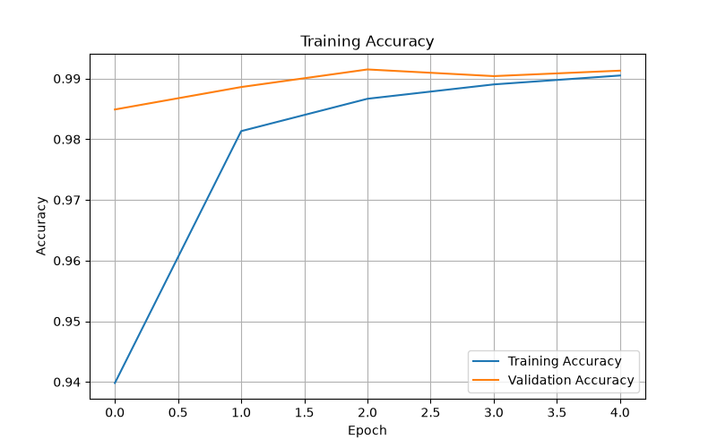
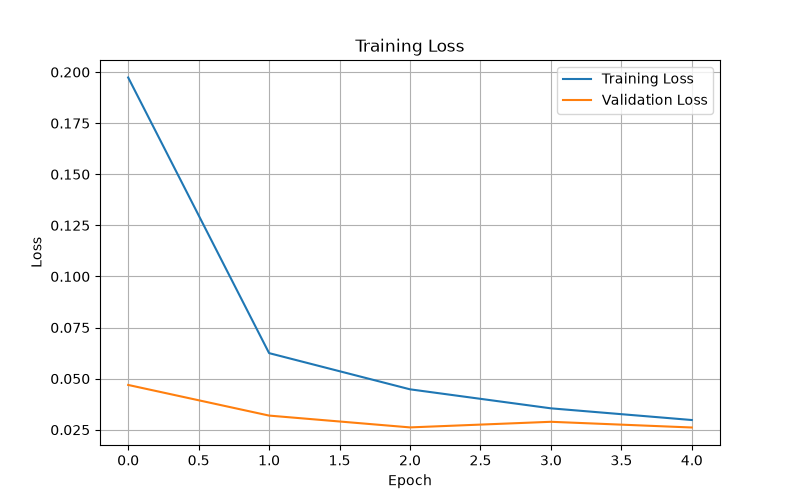

# ✍️ Handwritten Digit Recognition

A handwritten digit recognition web application powered by a **Convolutional Neural Network (CNN)** trained on the MNIST dataset.

The model is trained using **TensorFlow/Keras** and converted to **ONNX** for lightweight production inference. The application uses **Flask**, **OpenCV**, and **ONNX Runtime** to recognize digits drawn directly in the browser.

## 🌐 Live Demo

🚀 **Try the application here:**

https://handwritten-digit-recognition-kn8x.onrender.com/

> The application is deployed on Render. The first request may take a little longer if the service needs to start.

## 🚀 Features

- Draw handwritten digits directly in the browser
- Recognizes digits from **0–9**
- Displays prediction confidence across all classes
- CNN trained on the **MNIST dataset**
- OpenCV-based image preprocessing
- Lightweight inference using **ONNX Runtime**
- REST API powered by Flask
- TensorFlow is not required in production

## 🧠 Architecture

```text
MNIST Dataset
      │
      ▼
TensorFlow / Keras
      │
      ▼
   CNN Model
      │
      ▼
  model.keras
      │
      │ Convert to ONNX
      ▼
  model.onnx
      │
      ▼
 ONNX Runtime
      │
      ▼
   Flask API
      │
      ▼
 Web Interface
```

TensorFlow/Keras handles **model training**, while ONNX Runtime handles **production inference**.

## 🛠️ Tech Stack

**Machine Learning:** TensorFlow, Keras, ONNX  
**Inference:** ONNX Runtime  
**Backend:** Python, Flask  
**Image Processing:** OpenCV, NumPy  
**Frontend:** HTML, CSS, JavaScript  
**Production Server:** Gunicorn  
**Deployment:** Render

## 📁 Project Structure

```text
handwritten-digit-recognition/
│
├── app.py
├── index.html
├── model.onnx
├── model.keras
├── train_model.py
├── requirements.txt
├── accuracy.png
├── loss.png
├── .python-version
├── .gitignore
└── README.md
```

## ⚙️ Local Setup

Clone the repository:

```bash
git clone YOUR_REPOSITORY_URL
cd handwritten-digit-recognition
```

Create a virtual environment.

### Windows PowerShell

```powershell
python -m venv onnx_env
.\onnx_env\Scripts\Activate.ps1
```

### Windows Command Prompt

```bat
python -m venv onnx_env
onnx_env\Scripts\activate
```

Install dependencies:

```bash
python -m pip install --upgrade pip
pip install -r requirements.txt
```

Start the application:

```bash
python app.py
```

Open:

```text
http://127.0.0.1:5000
```

Do not open `index.html` directly because Flask serves both the frontend and the prediction API.

## 🔌 Prediction Pipeline

```text
Canvas Drawing
      ↓
Base64 PNG
      ↓
Flask API
      ↓
OpenCV Preprocessing
      ↓
Grayscale + Threshold
      ↓
Crop + Center
      ↓
28 × 28 × 1
      ↓
ONNX Runtime
      ↓
CNN Prediction
      ↓
Digit + Confidence
```

### `POST /predict`

The frontend sends the canvas drawing to the backend as a Base64-encoded PNG.

Example response:

```json
{
  "digit": 7,
  "confidence": 0.998,
  "probabilities": [
    0.0001,
    0.0002,
    0.0001,
    0.0003,
    0.0001,
    0.0001,
    0.0001,
    0.998,
    0.0004,
    0.0006
  ]
}
```

### `GET /health`

Used to verify that the backend and ONNX Runtime are available.

```json
{
  "status": "ok",
  "runtime": "ONNX Runtime"
}
```

## 🏋️ Model Training

The CNN is trained on the MNIST handwritten digit dataset.

To retrain:

```bash
python train_model.py
```

Training generates the Keras model and performance graphs:

```text
model.keras
accuracy.png
loss.png
```

The trained model is then converted from Keras to ONNX for production deployment.

## 📊 Model Performance

### Training & Validation Accuracy



### Training & Validation Loss



The curves show the training and validation performance of the CNN across epochs.

## 🌐 Deployment

The production application uses:

```text
Browser
   │
   ▼
Render
   │
   ▼
Gunicorn
   │
   ▼
Flask
   │
   ▼
OpenCV
   │
   ▼
ONNX Runtime
   │
   ▼
model.onnx
```

TensorFlow is **not required on the production server**.

### Render Configuration

**Build Command**

```bash
pip install -r requirements.txt
```

**Start Command**

```bash
gunicorn --bind 0.0.0.0:$PORT --workers 1 --timeout 60 app:app
```

### Live Deployment

https://handwritten-digit-recognition-kn8x.onrender.com/

## 💡 Why ONNX?

The model was originally trained using TensorFlow/Keras. TensorFlow worked well for training, but running the complete TensorFlow runtime on a lightweight production server introduced unnecessary resource overhead for a small MNIST CNN.

ONNX Runtime provides a lightweight inference environment while allowing TensorFlow/Keras to remain the training framework.

```text
TensorFlow/Keras → Training
        ↓
    model.keras
        ↓
      ONNX
        ↓
    model.onnx
        ↓
  ONNX Runtime → Production Inference
```

## 📜 License

This project is intended for educational and learning purposes.
